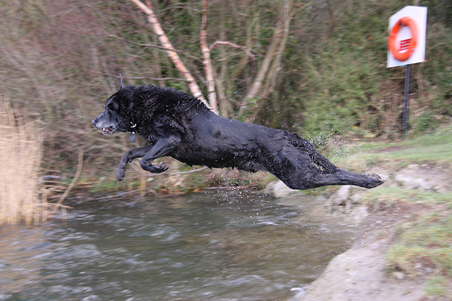
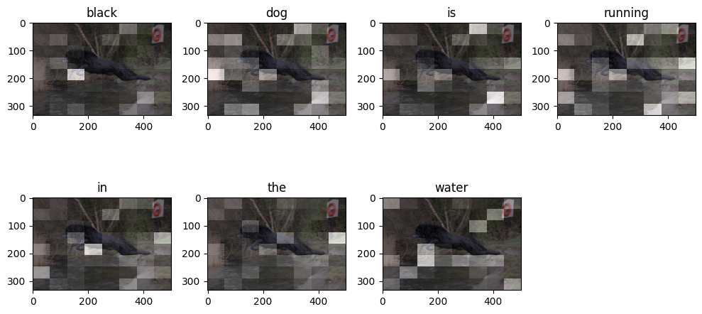

# Attention-Enhanced Image Captioning Using VGG16 and GRU Networks
<h2>Overview</h2>

This project implements an image captioning system using a combination of a Convolutional Neural Network (CNN) for image feature extraction and a Recurrent Neural Network (RNN) for sequence generation. The attention mechanism allows the model to focus on specific parts of an image while generating the caption.

<h2>Key Features</h2>
<ul>
  <li>CNN (VGG16): Used for extracting image features.</li>
  <li>GRU with Bahdanau Attention: Generates captions with attention mechanism.</li>
  <li>Dataset: Flickr8k dataset used for training and testing the model.</li>
  <li>Evaluation: BLEU scores are computed to evaluate the model's performance.</li>
</ul>

<h2>Files</h2>
<ul>
  <li>train_images.txt, test_images.txt, val_images.txt: Text files containing the names of images for training, testing, and validation.</li>
  <li>captions.txt: The dataset containing image IDs and captions.</li>
  <li>clean_captions.txt: Preprocessed captions.</li>
  <li>Encoder/Decoder.h5: Saved model weights for the encoder and decoder.</li>
  <li>loss.png: Training loss graph.</li>
  <li>sample_image.png: Sample image with predicted caption.</li>
  <li>attention.png: Attention map visualization for sample image.</li>
</ul>

<h2>Installation</h2>
<ol>
  <li>Clone the repository:
    <pre><code>git clone https://github.com/your-repository/image-captioning-with-attention.git
cd image-captioning-with-attention</code></pre>
  </li>
  <li>Install the required dependencies:
    <pre><code>pip install -r requirements.txt</code></pre>
  </li>
  <li>Download the dataset and place it inside the <strong>Flickr8k_Dataset</strong> folder.</li>
  <li>Run the training:
    <pre><code>python train.py</code></pre>
  </li>
  <li>To evaluate and generate captions on your own images:
    <pre><code>python evaluate.py</code></pre>
  </li>
</ol>

<h2>Model Architecture</h2>

The architecture consists of a pre-trained VGG16 model used for image feature extraction and a custom RNN model with Bahdanau Attention to generate captions. The attention mechanism helps the model focus on specific parts of the image while generating the corresponding words.

<h2>BLEU Scores</h2>
<table>
  <thead>
    <tr>
      <th>BLEU-1</th>
      <th>BLEU-2</th>
      <th>BLEU-3</th>
      <th>BLEU-4</th>
    </tr>
  </thead>
  <tbody>
    <tr>
      <td>0.70</td>
      <td>0.59</td>
      <td>0.51</td>
      <td>0.44</td>
    </tr>
  </tbody>
</table>

<h2>Results</h2>

<h3>Training Loss</h3>

<h3>Example Caption Generation</h3>

Sample image and its generated caption:

Prediction Caption: black dog is running in the water
Real Captions:
1)  black dog is leaping into creek 
2)  black dog is leaping over stream of running water 
3)  black dog jumping off river bank near wooded area 
4)  wet black dog jumping into lake 
5)  wet black dog leap across stream 

<h3>Attention Visualization</h3>

The following image demonstrates how the attention mechanism focuses on different parts of the image while generating each word in the caption:

<h2>Future Work</h2>
<ul>
  <li>Improve the model by using larger datasets and more advanced architectures like Transformer models.</li>
  <li>Integrate a real-time application for image captioning, possibly using a web interface.</li>
</ul>
